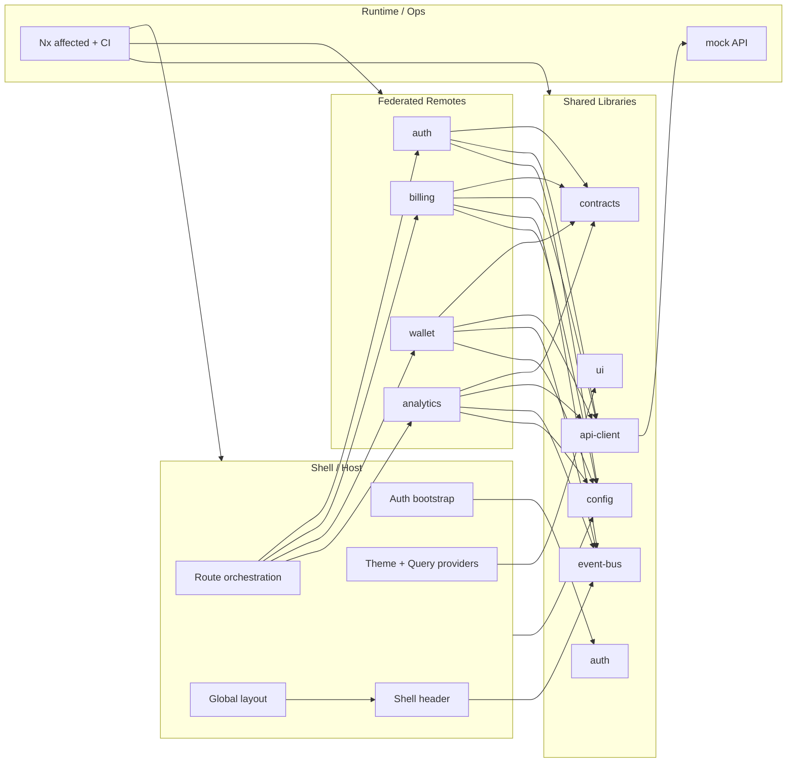

# Modular Payments Console

Um workspace de microfrontend com Nx, pronto para portfólio, construído com React, TypeScript, Rspack e Module Federation.

Este repositório demonstra uma arquitetura prática de `shell` e `remotes`, com fronteiras de domínio claras, bibliotecas compartilhadas, pipelines isolados e um caminho pequeno, mas realista, para times evoluírem de forma independente.

## Objetivo Arquitetural

Este projeto existe para mostrar como uma plataforma frontend pode:

- manter um `shell` enxuto responsável por layout, roteamento, bootstrap de auth/sessão e providers compartilhados
- permitir que remotes de domínio evoluam de forma independente sem importar uns aos outros diretamente
- compartilhar apenas bibliotecas transversais estáveis, como UI, contratos, helpers de auth, config, API client e event bus
- funcionar bem com pipelines `affected` do Nx, exploração local do graph e validação de CI por time

## Visão Arquitetural



Em termos práticos, o `shell` orquestra autenticação, layout, providers e composição dos remotes; os remotes ficam donos do seu roteamento e das telas de domínio; e as libs compartilhadas concentram apenas contratos e capacidades transversais estáveis.

## Stack

- `Nx 22`
- `React 18`
- `TypeScript`
- `Rspack`
- `Module Federation`
- `React Router`
- `TanStack Query`
- `Zustand`
- `Jest`
- `ESLint`

## Estrutura do Monorepo

```text
apps/
  shell/        # aplicação host
  auth/         # remote público de autenticação
  billing/      # remote de domínio de cobrança
  wallet/       # remote de domínio de carteira
  analytics/    # remote de domínio de analytics

libs/
  ui/           # primitivas visuais compartilhadas e tema
  contracts/    # tipos compartilhados e contratos de eventos
  auth/         # store de auth, schemas e helpers de sessão
  api-client/   # wrapper HTTP para o mock atual e futuros backends
  event-bus/    # pub/sub tipado para comunicação shell <-> remote
  config/       # metadados de rota, constantes da app e defaults do shell

tools/
  mock-api/     # API local usada pelo shell e pelos remotes
  scripts/      # scripts do workspace

docs/
  architecture.md
  screenshots/
```

## Shell / Host

O `shell` é a aplicação host.

Ele é responsável por:

- layout global, sidebar e header
- separação entre rotas públicas e protegidas
- bootstrap da sessão de auth e fluxo de logout
- providers compartilhados, como tema e React Query
- composição dos remotes em runtime via Module Federation
- fallback de loading e error boundary para falhas de remotes

O shell intencionalmente não é dono das regras de negócio de billing, wallet ou analytics.

## Remotes

Remotes atuais:

- `auth`: fluxo de login e cadastro
- `billing`: dashboard de billing e rotas placeholder aninhadas
- `wallet`: dashboard de wallet e rotas placeholder aninhadas
- `analytics`: dashboard de analytics e rotas placeholder aninhadas

Cada remote:

- expõe `./Routes`
- mantém seu roteamento interno ao domínio
- pode rodar isoladamente durante o desenvolvimento
- herda os providers do shell quando é composto no host

Portas de desenvolvimento isolado:

- `shell`: `http://localhost:4200`
- `billing`: `http://localhost:4201`
- `wallet`: `http://localhost:4202`
- `analytics`: `http://localhost:4203`
- `auth`: `http://localhost:4205`

## Bibliotecas Compartilhadas

As bibliotecas compartilhadas ficam fora do shell e evitam acoplamento direto com um remote específico.

- `libs/ui`: primitivas de UI reutilizáveis, theme provider, primitivas de sidebar e utilitários
- `libs/contracts`: contratos de rota, tipos de dashboard e contratos de eventos do shell
- `libs/auth`: store compartilhada de auth e helpers de validação com Zod
- `libs/api-client`: estrutura HTTP tipada para o mock atual e futuras integrações com backend
- `libs/event-bus`: pub/sub tipado usado apenas para preocupações de composição entre shell e remotes
- `libs/config`: metadados de rota, defaults do shell, constantes da app e descritores dos remotes

Intencionalmente não existe uma lib genérica `common`. Cada lib compartilhada tem responsabilidade estreita.

## Module Federation

O shell carrega os remotes de forma lazy via Module Federation:

- `auth/Routes`
- `billing/Routes`
- `wallet/Routes`
- `analytics/Routes`

Comportamento em runtime:

- `React.lazy(...)` compõe os remotes apenas quando a rota precisa deles
- `Suspense` renderiza um fallback visual enquanto o bundle remoto está carregando
- um error boundary dedicado mantém o shell vivo se um remote falhar ao carregar

Isso significa que o host nunca importa internals dos remotes por caminho local.

## Event Bus

A biblioteca `event-bus` contém uma implementação pequena e tipada de pub/sub.

Caso de uso atual:

- os remotes publicam contexto de página para o header do shell
- o shell atualiza badge e breadcrumb sem ser dono dos detalhes internos de rota do remote

Use o event bus quando:

- shell e remote precisarem de coordenação leve de UI
- a mensagem for efêmera
- a interação precisar continuar desacoplada do estado de domínio

Não devemos usar o event bus quando:

- o dado for estado persistente da aplicação
- a preocupação pertencer a auth/sessão
- a informação for local a um único remote
- um contrato direto de rota ou de API for mais claro

## Por Que Nx Importa Aqui

Nx não é apenas scaffolding neste repositório. Ele faz parte da demonstração:

- cada app e cada lib compartilhada possuem targets isolados de `lint` e `test`
- cada app possui target isolado de `build`
- `nx affected` consegue escopar o trabalho para apps/libs alterados
- o project graph torna shell, remotes e libs compartilhadas fáceis
- a pipeline de CI consegue validar apenas as partes impactadas do workspace, sem perder smoke builds isolados por remote

## Como Começar

Instale as dependências:

```sh
pnpm install
```

Rode o shell:

```sh
pnpm dev
```

Rode shell + mock API:

```sh
pnpm dev --mock
```

Rode apenas a mock API:

```sh
pnpm mock:api
```

Credenciais demo:

```text
email: demo@modular-payments.local
password: Password123!
```

## Rodando Cada Remote Isoladamente

```sh
pnpm nx serve shell
pnpm nx serve auth
pnpm nx serve billing
pnpm nx serve wallet
pnpm nx serve analytics
```

Isso é útil para desenvolvimento focado por domínio e para explicar como times independentes poderiam trabalhar sem sempre subir a plataforma inteira.

## Build, Test, Lint e Graph

```sh
pnpm build
pnpm test
pnpm lint
pnpm graph
```

Comandos `affected`:

```sh
pnpm affected:build
pnpm affected:test
pnpm affected:lint
pnpm ci
```

Quando você quiser fronteiras explícitas de git:

```sh
pnpm nx affected -t build --base=origin/main --head=HEAD
pnpm nx affected -t test --base=origin/main --head=HEAD
pnpm nx affected -t lint --base=origin/main --head=HEAD
```

Para inspecionar a estrutura do workspace:

```sh
pnpm nx show projects
pnpm nx show project shell --json
```

## Pipelines Isolados

Este workspace foi estruturado para que times diferentes consigam validar seu próprio escopo:

- o time de `billing` pode rodar lint, test e build apenas de `billing`
- o time de `wallet` pode fazer o mesmo para `wallet`
- o time de plataforma/host pode focar em `shell` e libs compartilhadas
- `nx affected` mantém mudanças em libs compartilhadas visíveis para os times impactados

Essa é a principal proposta de valor que o repositório tenta demonstrar.

## CI/CD

O GitHub Actions está em [`.github/workflows/ci.yml`](./.github/workflows/ci.yml).

O workflow:

- instala as dependências com `pnpm`
- resolve os SHAs corretos do Nx para execução `affected`
- roda `lint`, `test` e `build` com `nx affected`
- roda uma pequena matrix de build para que `shell` e cada remote ainda possam ser validados isoladamente

Em um setup de produção, cada remote poderia publicar seu próprio artefato enquanto o shell referencia os `remoteEntry`s implantados por meio de config por ambiente.

## Como a Mock API Entra Nisso

A mock API local existe para manter a demo de portfólio executável de ponta a ponta.

Hoje ela expõe:

- `POST /api/auth/login`
- `POST /api/auth/register`
- `GET /api/auth/me`
- `GET /api/billing/dashboard`
- `GET /api/wallet/dashboard`
- `GET /api/analytics/dashboard`

Isso já é suficiente para demonstrar:

- bootstrap de auth no shell
- reuso da sessão compartilhada nos remotes protegidos
- fetch local ao remote usando providers compartilhados de React Query

## Como Adicionar um Novo Remote

Use o Nx para gerar o remote:

```sh
pnpm nx g @nx/react:remote apps/reports \
  --host=shell \
  --bundler=rspack \
  --dynamic=false \
  --unitTestRunner=jest \
  --e2eTestRunner=none \
  --globalCss=true \
  --style=css
```

Depois da geração:

1. Exponha apenas `./Routes`.
2. Mantenha as regras de domínio dentro do remote, e não do shell.
3. Registre os metadados de rota em `libs/config`.
4. Reaproveite libs compartilhadas apenas para preocupações transversais estáveis.
5. Decida se o shell realmente precisa de eventos leves de UI vindos do remote.

## Decisões Arquiteturais

- Module Federation é usado para composição em runtime, não para compartilhar lógica de negócio.
- O shell é dono do bootstrap de auth/sessão porque isso é uma preocupação de plataforma.
- Os remotes são donos de suas árvores de rota e de suas telas.
- As libs compartilhadas são separadas por responsabilidade, e não por conveniência.
- O event bus permanece intencionalmente pequeno e tipado.
- As páginas placeholder são explícitas para que o repositório mostre roteamento remoto aninhado sem fingir que regras de negócio ainda não implementadas já estão prontas.

## Trade-offs

- Microfrontends adicionam overhead operacional em comparação a uma SPA única.
- Dependências compartilhadas precisam ser bem cuidadas para evitar drift de versão.
- Shell pode ficar inchado se começar a absorver regras de domínio.
- Comunicação orientada a eventos é flexível, mas precisa de disciplina para não virar acoplamento escondido (deve-se decidir padrão entre times de desenvolvimento).
- Para um time pequeno entregando um único produto coeso, um monólito modular pode ser mais simples (e continua sendo a melhor escolha).

## Próximos passos que faria

- Adicionar manifests reais de deploy de remotes por ambiente
- Adicionar testes de contrato em torno dos remote entrypoints
- Adicionar cobertura e2e para shell + navegação federada
- Adicionar telemetria de saúde dos remotes e instrumentação de retry
- Substituir os endpoints mock por uma camada real de integração com backend

## Screenshots

Os espaços reservados para screenshots estão em [docs/screenshots/README.md](./docs/screenshots/README.md).

Capturas sugeridas:

- tela pública de auth
- shell protegido com um remote carregado
- project graph
- remote isolado rodando standalone

## Notas de Arquitetura

A explicação arquitetural mais longa está em [docs/architecture.md](./docs/architecture.md).

Ela cobre:

- por que microfrontends foram escolhidos
- quais problemas essa arquitetura resolve
- como times independentes poderiam colaborar
- como a independência de deploy poderia funcionar
- quando não usar microfrontends
- fronteiras de ownership entre shell, remotes, auth e event bus

## Pontos para Entrevista

- Usei Nx porque o desafio principal aqui não é só organização de código, mas também pipelines isolados, visibilidade do graph e execução `affected` entre shell, remotes e libs compartilhadas.
- Usei Module Federation porque queria composição em runtime entre host e remotes evoluindo de forma independente, e não apenas um monólito modular organizado por pastas.
- Usei Rspack porque ele mantém o setup moderno e rápido, ao mesmo tempo em que encaixa bem com Nx e Module Federation.
- O shell carrega os remotes de forma lazy por meio de entradas federadas `./Routes`, envolve esse carregamento com estado visual de loading e protege o host com error boundary.
- Os remotes ficam isolados ao serem donos apenas de seu roteamento e UI de domínio, enquanto o shell é dono do layout, bootstrap de sessão e providers compartilhados.
- As libs compartilhadas foram mantidas estreitas de propósito, para que código reutilizável permaneça estável e regras de domínio não vazem para pacotes globais.
- O CI/CD pode usar `nx affected` para validação rápida, sem perder a capacidade de cada time fazer smoke test isolado do seu próprio remote.
- O principal trade-off é a disciplina operacional e arquitetural extra: microfrontends compensam quando fronteiras de time e de deploy são reais.
- Em uma versão de produção, eu adicionaria manifests implantados por ambiente, cobertura e2e, testes de contrato e workflows de release conscientes do ambiente.
